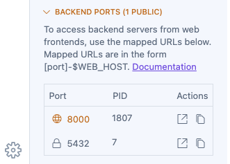

- [Project IDX](https://developers.google.com/idx): A cloud-based development environment by Google that offers a browser-first workspace for coding, featuring built-in AI assistance and seamless integration with development tools
- [FastAPI Full Template](https://fastapi.tiangolo.com/project-generation/): A production-ready project generator for FastAPI applications that includes user management, authentication, SQLAlchemy models, and Docker configuration out of the box

What is going on here?

1. The FastAPI Full Template’ Copier template is executed with default answers (-l)

   ```bash
   copier copy -l '[https://github.com/fastapi/full-stack-fastapi-template](https://github.com/fastapi/full-stack-fastapi-template)' my-awesome-project --trust
   ```

2. React frontend is installed and built

   ```bash
   npm ci --no-audit --prefer-offline --no-progress --timing
   ```

3. PostgreSQL database is built and started via Docker Compose

   ```bash
   docker compose up db prestart
   ```

4. FastAPI backend is started

   ```bash
   fastapi dev app/main.py
   ```

5. Backend tests are executed as a Smoke Test

   ```bash
   ./scripts/test.sh
   ```

6. IDX’s Web Preview is started

   ```bash
   npm run dev
   ```

## Dependencies

The project requires:

- Python 3.x
- FastAPI
- Docker and Docker Compose
- PostgreSQL

## Installation

Use this repo as the template for your project

[https://github.com/project-idx/community-templates/tree/main/full-stack-fastapi-template](https://github.com/project-idx/community-templates/tree/main/full-stack-fastapi-template)

Project IDX Generator:

[https://idx.google.com/new](https://idx.google.com/new)

<a href="https://idx.google.com/new?template=https%3A%2F%2Fgithub.com%2Fgetmarkus%2Fcommunity-templates%2Ftree%2Fmain%2Ffull-stack-fastapi-template">
  <picture>
    <source
      media="(prefers-color-scheme: dark)"
      srcset="https://cdn.idx.dev/btn/open_dark_32.svg">
    <source
      media="(prefers-color-scheme: light)"
      srcset="https://cdn.idx.dev/btn/open_light_32.svg">
    
  </picture>
</a>

## Configuration

By default the [Copier](https://copier.readthedocs.io/) will execute with default values:

```bash
test-fastapi-full-6064653:~/test-fastapi-full$ pipx run copier copy https://github.com/fastapi/full-stack-fastapi-template my-awesome-project --trust
🎤 The name of the project, shown to API users (in .env)
   FastAPI Project
🎤 The name of the stack used for Docker Compose labels (no spaces) (in .env)
   fastapi-project
🎤 'The secret key for the project, used for security,
stored in .env, you can generate one with:
python -c "import secrets; print(secrets.token_urlsafe(32))"'
   changethis
🎤 The email of the first superuser (in .env)
   admin@example.com
🎤 The password of the first superuser (in .env)
   changethis
🎤 The SMTP server host to send emails, you can set it later in .env

🎤 The SMTP server user to send emails, you can set it later in .env

🎤 The SMTP server password to send emails, you can set it later in .env

🎤 The email account to send emails from, you can set it later in .env
   info@example.com
🎤 'The password for the PostgreSQL database, stored in .env,
you can generate one with:
python -c "import secrets; print(secrets.token_urlsafe(32))"'
   changethis
🎤 The DSN for Sentry, if you are using it, you can set it later in .env
```

## Known Issues

Note: In order to allow the frontend to talk to the backend the backend port must be made [**Public**](https://community.idx.dev/t/early-preview-of-public-ports/1911). Why? Dunno.


