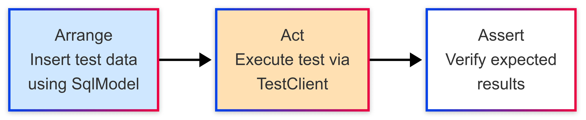

### Why it matters

Proper test configuration prevents accidental production data manipulation and ensures accurate integration testing.

### The big picture

FastAPI offers robust testing tools, but setting up test environments can be tricky. Here’s a streamlined approach using .env files and a custom app factory.

### Why should I care about all this?

First, you likely don't want to run integration tests against your production configuration even if you have modified your local .env file by mistake. Second, in the Arrange-Act-Assert pattern, you may need to insert data in the 'Arrage' stage, which would then not be aligned correctly when you execute the integration test via the TestClient.



FastAPI includes testing tools and patterns for writing unit and integration tests. A great tool for integration testing is TestClient provided by FastAPI. See [FastAPI Testing](https://fastapi.tiangolo.com/tutorial/testing/). TestClient wraps the [httpx package](https://www.python-httpx.org/). This TestClient can be used to make HTTP requests to the application. See [TestClient](https://fastapi.tiangolo.com/tutorial/testing/#testclient).

Additionally, FastAPI recommends using Pydantic for Settings configuration. See [FastAPI Settings](https://fastapi.tiangolo.com/tutorial/settings/). As Pydantic understands and uses python-dotenv, we can use the same approach to create a Settings class for our tests.

My preference is to use .env files for configuration and environment variables. It is a good practice to store configuration in a .env file following the 12-factor approach.

However, there are some **drawbacks to overcome for practical adoption**:

- The recommended approach is to use `app.dependency_overrides` to override the settings class instance especially when also using Dependency Injection [dependency_overrides](https://fastapi.tiangolo.com/advanced/testing-dependencies/).
  - However, I have found this complicated and sometimes flakey.
- By default, FastAPI will pick up your `.env` file from the root of your project and won't load anything like a `.env.test` file.
- You will need to organize you code in a way that the main FastAPI application is not instantiated when running tests.
  - This is especially important if you are caching your settings with the `@lru_cache()` decorator.

**Key improvements:**

- Separate test configuration: Use a `.env.test` file to isolate test settings.
- App factory pattern: Create your FastAPI app on-demand for better test control.
- Simplified dependency overrides: Avoid complex overrides by loading test settings early.

### How it works

I have a repo for the full example: [https://github.com/getmarkus/fastapi-test-settings](https://github.com/getmarkus/fastapi-test-settings).

1. Ensure you have a `.env.test` file in the root of your project

   ```bash
   #.env
   APP_NAME="Awesome API"
   ```

   ```bash
   #.env.testing
   APP_NAME="Test App"
   ```

2. Include a `conftest.py` with `python-dotenv` configured

   ```python
   dotenv_path = Path(".env.testing")
   load_dotenv(dotenv_path=dotenv_path, override=True)

   settings = get_settings()
   ```

3. Extract the creation of the FastAPI app to a function

   ```python
   from fastapi import FastAPI
   from .config import get_settings


   def create_app() -> FastAPI:
       settings = get_settings()
       app = FastAPI()

       @app.get("/")
       async def read_main():
           return {"msg": settings.app_name}

       return app
   ```

4. From your `main.py` file, import `create_app` and call it

   ```python
   from .factory import create_app
   app = create_app()
   ```

5. In your `conftest.py` file, setup an app fixture

   ```python
   @pytest.fixture(name="app")
   def test_app():
       """Create test app instance only during test execution."""
       return create_app()
   ```
